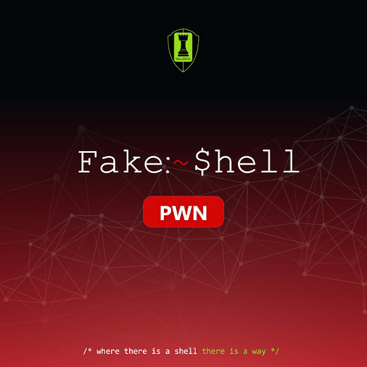

# Fake $hell



### Description
```
While learning programming, I wrote a small fake terminal in C, it's very simple very few
supported commands, and only safe operations (no unsafe system() calls for example).
It is accessible at: terminal.challs.shellmates.club:1337

Goal: Prove you can escape from the fake shell to the real shell.
```
```
pwndbg> checksec 
RELRO           STACK CANARY      NX            PIE
Partial RELRO   No canary found   NX enabled    PIE enabled
```
Here is the  binary and the  files.<br>
When we connect using netcat and check the supported commands, we find these eight commands<br>
```
mate@pwnable:/ $ help
Supported commands
ls	id	whoami	echo	printf
cat	pwd	cd	help	exit
mate@pwnable:/ $
```
good, we can use printf() to leak addresses to bypass ASLR and write anywhere in memory<br>

by looking at the decompiled binay with ghidra we find an interessting function process_cmd()<br>
which executes the parced command and return, we will overwrite its return address to spawn<br>
a shell using one gadget:<br>
```
$ one_gadget libc-2.27.so 
0x10a38c execve("/bin/sh", rsp+0x70, environ)
constraints:
  [rsp+0x70] == NULL
```
in this  i leaked rbp to calculate the address of the format string<br>
and libc_start_main (the return address of main) to calculate the address of one gadget at run time<br>
```python2
```
# Flag
```
$ cat flag.txt
shellmates{f4ke_term1nal_r3al_pr1%ntf!}
$
```
